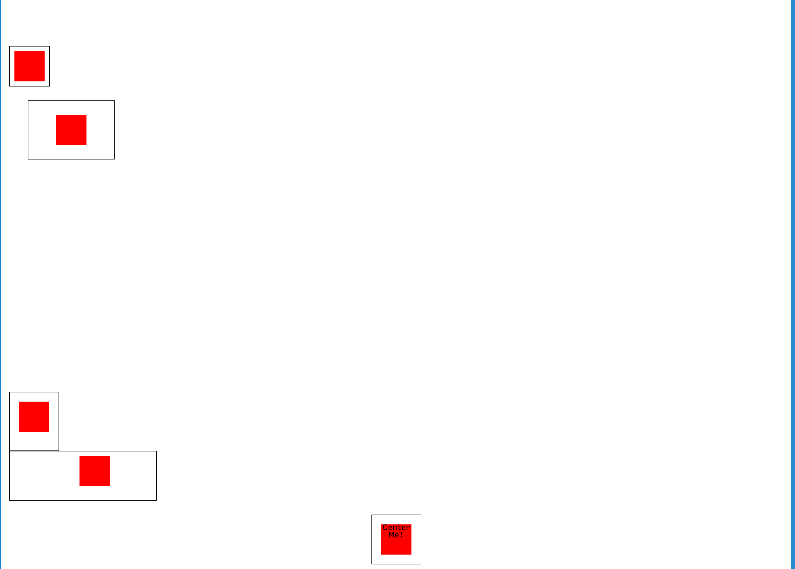

# Box-Boxer - A Margin And Padding Exercise

### Learning Objectives

After this activity, students should be able to:

- Explain how margins and padding affect content on the web.
- Have some familiarity with adding and changing margin and padding rules.

### Setup

Fork and clone this repository and open it in VS Code.

### Submission

You will submit this project on Canvas with a Pull Request. For an update on how to do this, please see [our Guide To Pull Requests](https://github.com/AnnieCannons/intro-to-programming-curriculum/blob/main/git/resources/github-pull-request-guide.md).

### Goal

Your goal is to make the current page **approximately** match the following picture:

Note that you do **not** have to match it pixel for pixel. If it looks like a box is _about_ 100 pixels from the side of the page on your screen, then set it to be 100 pixels from the side of the page. **Our exact values are not your goal.**

### Resources

You might want to read about how to **center a div horizontally**.

You might also want to move some divs closer to each other than the default 30 pixels set in the `div` rules. You can achieve this by overriding the rule for a specific div, setting it to use **negative margins**.

[This fantastic guide to margins](https://css-tricks.com/almanac/properties/m/margin/) has sections on both centering a div and using negative margins to move things closer together.

### Instructions

- You will strive to **approximately** match the goal screenshot in the Goal section above.
- You should achieve this using **only** margin and padding rules.
- You should **not** edit the **HTML** file.
- You should **not** edit the CSS **above** the warning comments in the **CSS** file.
- You **should** add padding and margin rules **below** the warning comments, in the CSS blocks for `.first`, `.second`, etc.
- You **should** center the fifth div. If you change your browser window's width, the div should **stay in the middle**!
